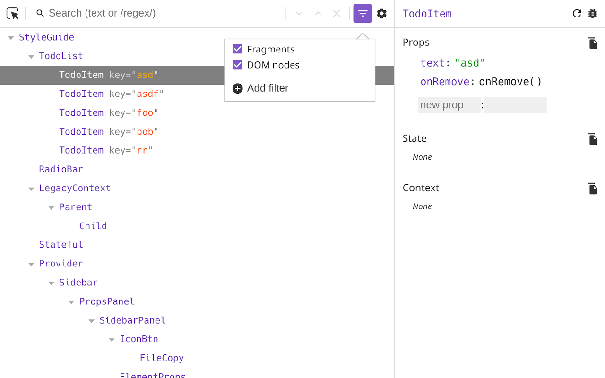

# Preact Devtools

Browser extension that allows you to inspect a Preact component hierarchy,
including props and state.

⚠️ **Requires Preact >=10.1.0** ⚠️



## Usage

Firstly, we need to import `preact/debug` somewhere to initialize the connection
to the extension. Make sure that this import is **the first** import in your
whole app.

```javascript
// Must be the first import
import "preact/debug";

// Or if you just want the devtools bridge (~240B) without other
// debug code (useful for production sites)
import "preact/devtools";
```

Then, download the Preact Devtools extension for your browser:

- [Firefox](https://addons.mozilla.org/en-US/firefox/addon/preact-devtools/)
- [Chrome](https://chrome.google.com/webstore/detail/preact-developer-tools/ilcajpmogmhpliinlbcdebhbcanbghmd)
- [Edge](https://microsoftedge.microsoft.com/addons/detail/hdkhobcafnfejjieimdkmjaiihkjpmhk)

## Contributing

- Use `npm run dev` to start a demo page
- Use `npm run watch` to rebuild all extensions on any code changes
- Use `npm run build:firefox` or `npm run build:chrome` to create a release build

Chrome:

1. Go to extensions page
2. Enable developer mode
3. Click "Load unpacked"
4. Select `dist/chrome/` folder

Firefox:

1. Go to addons page
2. Click the settings icon
3. Select "Debug addons"
4. Click "Load temporary addon"
5. Select the `manifest.json` in `dist/firefox/`

When you've submitted your PR you can run `yarn changeset` to indicate whether this is:

- a major (breaking change)
- a minor (new feature)
- a patch (bugfix)

and describe your changes.

## For extension reviewers

These commands will build the extension and load it into a browser with a temporary profile. The browser will automatically navigate to [preactjs.com](https://preactjs.com). There you can test the extension.

Chrome:

1. Execute `npm run run:chrome`
2. Click on `Preact` tab in devtools

Firefox:

1. Exectue `npm run run:firefox`
2. Open devtools + click on `Preact` tab in devtools
